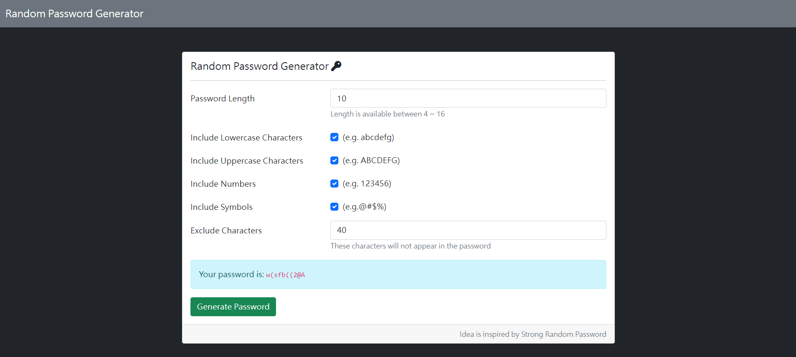

# 密碼產生器



## 介紹

建立密碼產生器，可以選擇密碼長度、是否要包含數字、特殊符號、排除哪些字元。

### 功能

- 使用者可以調整產生的密碼長度
- 使用者可以選擇產生的密碼中是否包含大小寫英文字母、數字、符號在內
- 使用者可以選擇哪些字元不要出現在產出來的密碼中
- 產生密碼

## 開始使用

1. 請先確認有安裝 node.js 與 npm
2. 將專案 clone 到本地
3. 在本地開啟之後，透過終端機進入資料夾，輸入：

   ```bash
   npm install
   ```
**根據"開發工具安裝適當的Express, Handlebars版本"**

4. 安裝完畢後，繼續輸入：

   ```bash
   npm run dev
   ```

5. 若看見此行訊息則代表順利運行，打開瀏覽器進入到以下網址

   ```bash
   Listening on http://localhost:3000
   ```

6. 若欲暫停使用

   ```bash
   ctrl + c
   ```

## 開發工具

- Node.js 18.17.0 
- Express 4.18.2
- Express-Handlebars 3.0.0
- Bootstrap 5.1.3
- Font-awesome 5.6.3
